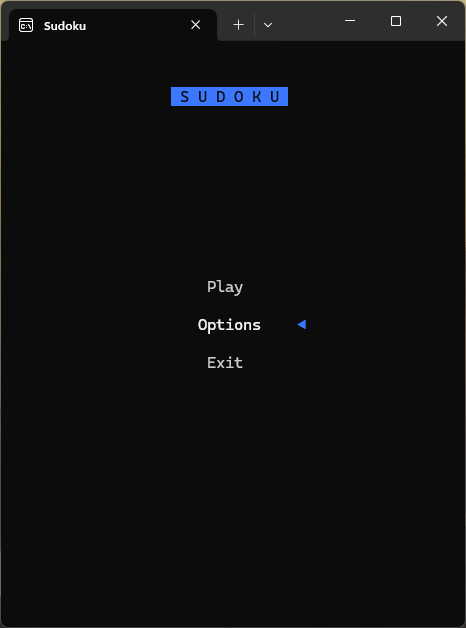
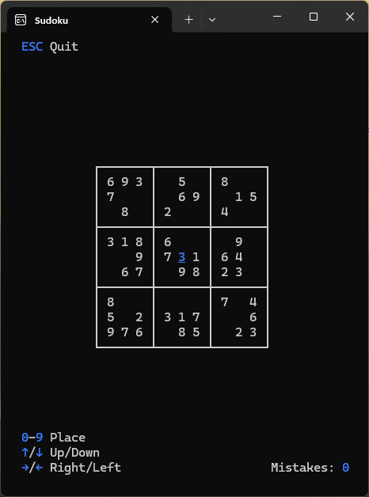
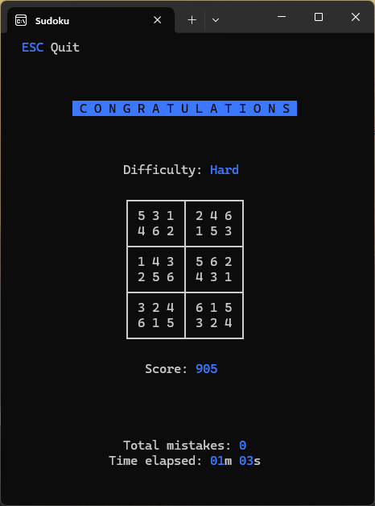

# Console Sudoku Project

A project made for my school's C assignment

## Game Screenshots

  
  
  

## How to Build the project
1. Clone the repository in Visual Studio:
   - `git clone https://github.com/Mushkrem/sudoku.git`
2. Build the solution inside Visual Studio (Release x64)
3. The built executable should be inside `.\x64\Release\sudoku.exe`

## Running the latest released executable
1. Download the latest executable from [Releases](https://github.com/Mushkrem/sudoku/releases/latest)
2. Simply run it on any Windows operating system

The project should be compatible with legacy consoles, ensuring correct rendering. However it was written for the latest [Windows Terminal](https://apps.microsoft.com/detail/9n0dx20hk701?hl=en-US&gl=US) application.

Additionally, all Sudoku-related coding tasks, including solving boards, generating new ones, and ensuring unique solutions, are handled within the `sudoku/game.c` file
